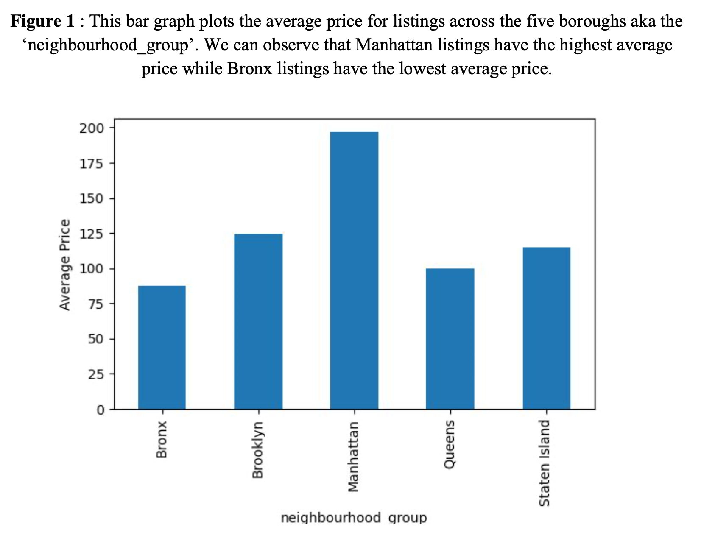
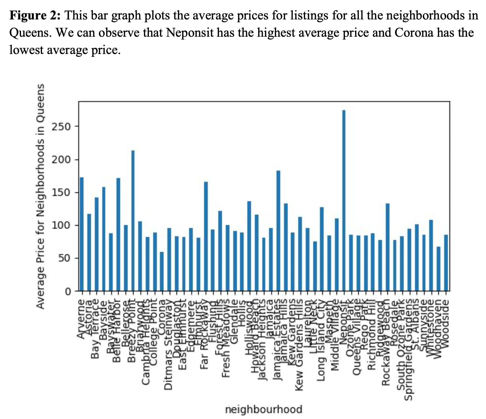
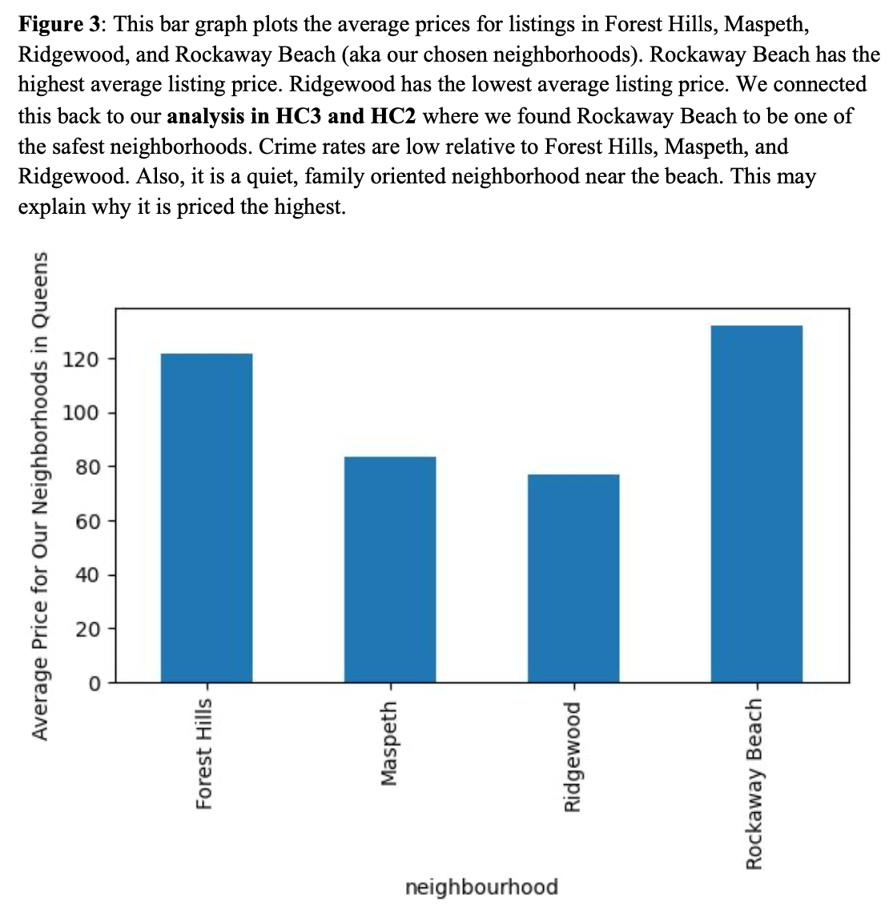
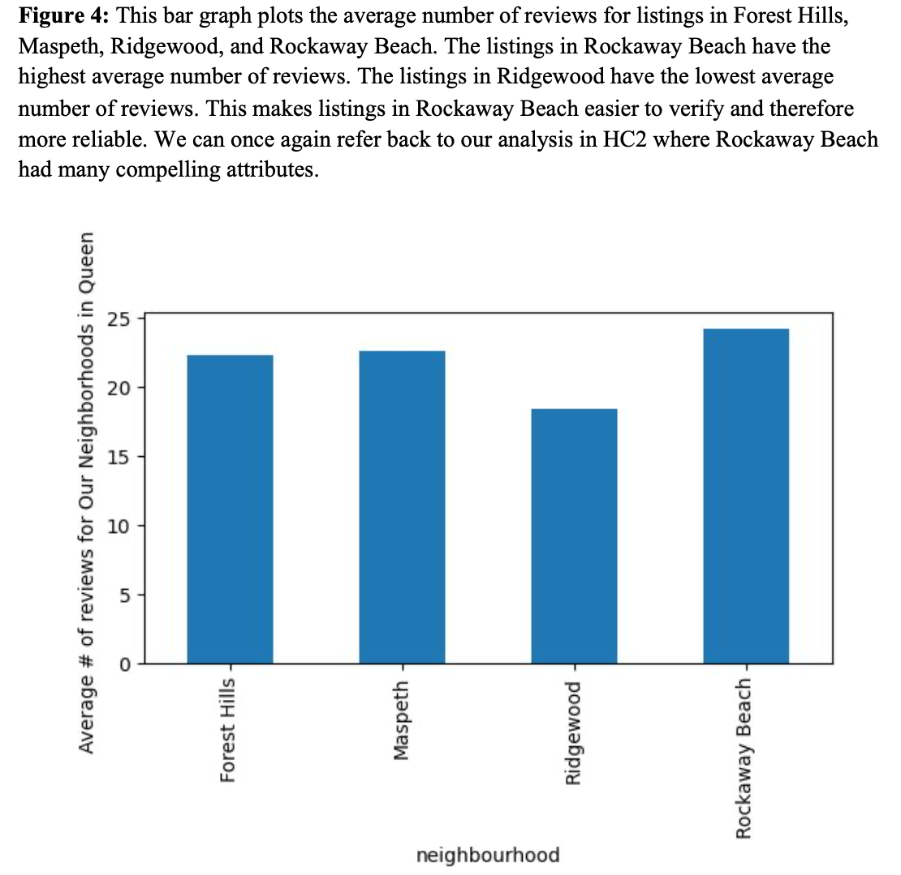
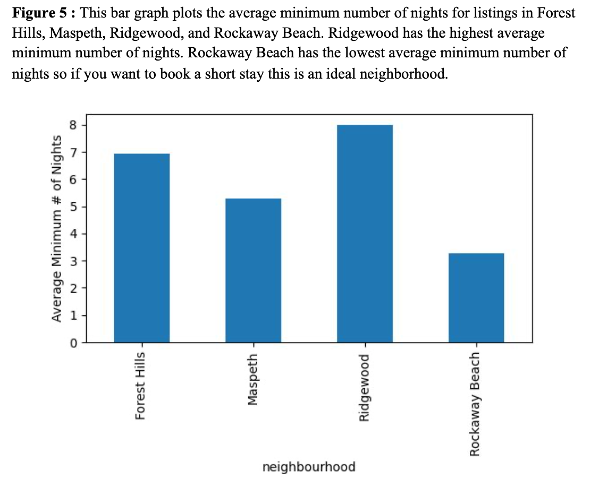

# Our Project:
Parsing through the 2019 NYC Airbnb data for Queens listings, our group focused on specific neighborhoods, namely Forest Hills, Maspeth, Ridgewood, and Rockaway Beach. We examined the demographic makeup, crime rates and commutes of each neighborhood. We observed that while Maspeth, Forest Hills, and Rockaway Beach are primarily white, Ridgewood is comprised of a largely Hispanic and White population. We also noticed that while all of the neighborhoods have access to trains and buses, many listings in Ridgewood for instance are not close to the neighborhood's transportation services. Finally, Ridgewood and Maspeth are on the more dangerous side in terms of crime because its rates are higher than national ones while Forest Hills and Rockaway Beach have relatively low crime rates. 

# Our Process:
Using python packages matplotlib, pandas, and numpy we created charts and graphs to visualize different aspects of the data. We examined average listings prices across Queens and noticed that Rockaway Beach has the highest average price for listings while Ridgewood has the lowest. We also noticed that Rockway Beach as the highest average number of reviews. Additionally, we created a bar graph that plots the average minimum number of nights for listings in Forest Hills, Maspeth, Ridgewood, and Rockaway Beach. Ridgewood has the highest average minimum number of nights while Rockaway Beach has the lowest average minimum number of nights so if you want to book a short stay this is an ideal neighborhood.

# Our Visuals:

# Our Individual Neighborhood Analysis: 
## Ridgewood: 
<https://nuzhatabida.github.io/Ridgewood-Airbnb-Analysis/>

## Maspeth:
<https://manav809.github.io/Maspeth-Neighborhood-Analysis/>

## Rockaway Beach
<https://leahahdoot.github.io/RockawayBeach/>

## Forest Hills
<https://petermanos.github.io/Forest-Hills/>
